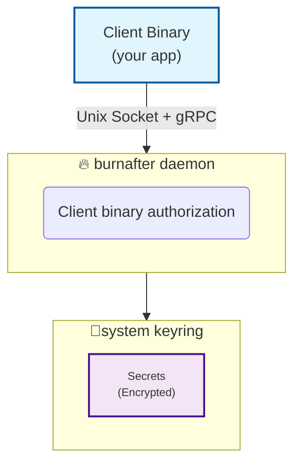

# 🔥burnafter

## Secrets that burn after reading

An ephemeral secret storage library and command line utility with binary verification.

## Overview

`burnafter` is a Go utility and library that provides
**time-limited, in-memory secret storage** with strong binary authentication and
persistence in the system keyring.

It's designed for scenarios where you need to store sensitive data temporarily
(like API keys, tokens, or passwords) that survives across command invocations
and want to ensure only a specific application binary can access it.

## Key Features

- **Minimal dependencies**: Almost no expternal dependencies
- **Ephemeral Storage**: Secrets stored in the system keyring or in memory, never written to disk (unless the fallback mechanism kicks in)
- **Binary Verification**: Only the exact binary that stored a secret can retrieve it (via SHA256 hash verification)
- **Time-Limited**: Secrets expire based on inactivity timeout or at an absolute deadline
- **Process Isolation**: Uses server session IDs to prevent replaying older keys on server restarts
- **On-Demand Key Derivation**: Encryption keys derived when needed, never stored in memory
- **Encrypted at Rest**: Secrets encrypted in memory using AES-256-GCM
- **Automatic Cleanup**: Server shuts down after inactivity period or secret expiration
- **No Persistency**: Client binary updates invalidate access (by design)

<!-- markdownlint-disable MD010 -->

## Security Model

For a complete overview of the security model, see the
[Security and Architecture](docs/security.md) document.

### How It Works

#### Architecture (Server Mode)

Applications wishing to store secrets use the burnafter client library. In server
mode (enabled with `WithServerLauncher(embedded.Launch)`), burnafter launches a
small daemon that handles client authentication and secret encryption and
in-memory storage:


```mermaid
graph TD
    Client["Client Binary<br/>(your app)"]
    subgraph daemon["🔥 burnafter daemon"]
      Auth(Client binary authorization)
    end

    subgraph keyring["🐧system keyring"]
      Secrets["Secrets<br/>(Encrypted)"]
    end

    Client -->|Unix Socket + gRPC| daemon
    daemon --> keyring

    style Client fill:#e1f5ff,stroke:#01579b,stroke-width:2px
    style Secrets font-size:0.9em,fill:#f3e5f5,stroke:#4a148c,stroke-width:2px
```

1. **Client Authentication**:
   - Client binary hash (SHA256)
   - Client nonce (constant defined or embedded in client binary)
   - Server verifies client via Unix socket peer credentials (using [`SO_PEERCRED`](https://man7.org/linux/man-pages/man7/unix.7.html#:~:text=SO_PEERCRED%0A%20%20%20%20%20%20%20%20%20%20%20%20%20%20This%20read%2Donly,using%20socketpair(2).))

2. **Key Derivation** (HKDF-SHA256):

   ```go
   key = HKDF(
       client_binary_hash +
       compile_time_nonce +
       server_session_id +
       secret_name,
       random_salt
   )
   ```

3. **Storage**:
   - Secrets are encrypted with a derived key
   - Keys are never stored (derived on-demand)
   - Server session ID lost on restart (makes secrets unrecoverable)
   - Secrets are kept in the system keyring, or in memory only if keyring not avilable (see fallback mechanism)

4. **Access Control**:
   - Server verifies client binary hash matches the expected client digest
   - Server checks client-defined nonce matches
   - Secrets expire based on TTL or on inactivity threshold

### Threat Model

Designed for defense in depth scenarios, burnafter is not intended to be 100%
impregnable but rather to help keep secrets safer and to be used together with
other protection mechhanisms.

#### Protects Against

- Accidental secret leakage to logs/files
- Other programs accessing secrets
- Long lived secrets persisting in the filesystem
- Key exposure

#### Does NOT Protect Against

- Debuggers attached to server process
- Root/admin users attaching to server process

## Usage

burnafter is designed to work as a library, but it also offers a command line
utility that can be used to store secrets from shell scripts, etc.

### Basic Commands

```bash
# Store a secret (with 2-hour TTL)
burnafter store api-key "my-secret-token" 7200

# Retrieve a secret
burnafter get api-key

# Check if the server is running
burnafter ping

```

### Command line flags

Flags in the cli utility are simple for now, you can enable debugging and
control where the [server unix socket](docs/socket.md) is written.

```text
-socket string    Unix socket path (default: auto-generated based on binary hash)
-debug            Enable debug output
```

### Examples

Here are some usage examples, see the [QUICKSTART.md](docs/QUICKSTART.md) for
a more in depth guide.

#### Store GitHub Token

```bash
# Store for 4 hours (default)
burnafter store github-token "ghp_xxxxxxxxxxxx"

# Store for 1 hour (3600 seconds)
burnafter store github-token "ghp_xxxxxxxxxxxx" 3600
```

#### Use in Scripts

For scripting, use the burnafter binary. It is limited to simple I/O but feel
free to suggest features to improve it.

```bash
#!/bin/bash

# Secrets can be stored on first run:
burnafter store db-password "$(pass show prod/db)"

# Retrieve secret in a script
DB_PASS=$(burnafter get db-password)
mysql -u user -p"$DB_PASS" mydatabase
```

#### Storage modes

A client stores secrets in one of three backends; the API (`Store`/`Get`/`Delete`)
is identical across all of them:

- **Server (default for `cmd/burnafter`)** — the embedded daemon backed by the
  system keyring (Linux kernel keyring) or macOS Keychain. Shared across processes
  on the same host. **Opt-in** (see below).
- **Encrypted file fallback** (`options.NoServer`) — secrets are AES-256-GCM
  encrypted to per-key files under the OS temp dir. Per-process, no daemon.
- **In-memory** (`options.InMemory`) — secrets are AES-256-GCM encrypted and held
  only in process memory: no daemon, no files, gone on restart. Ideal for a
  long-lived daemon that just needs an ephemeral secure cache. It prefers the
  kernel keyring (kernel memory) where available and otherwise uses an encrypted
  heap map.

##### The embedded server is opt-in

The embedded server is a multi-megabyte binary compiled into your program via
`//go:embed`. To avoid paying that size cost when you don't use server mode, it
lives in a separate package — `github.com/carabiner-dev/burnafter/embedded` — and
you enable it explicitly with `WithServerLauncher(embedded.Launch)`. Programs that
only use the file or in-memory modes never import that package, so the linker
leaves the embedded binary out of their build entirely.

With no launcher configured, a client that isn't in `NoServer`/`InMemory` mode
degrades to the encrypted file fallback instead of starting a server.

#### Library Integration

For Go applications, use burnafter as a library for programmatic access:

```go
package main

import (
	"context"
	"fmt"
	"log"

	"github.com/carabiner-dev/burnafter"
	"github.com/carabiner-dev/burnafter/embedded"
	"github.com/carabiner-dev/burnafter/options"
)

func main() {
	ctx := context.Background()

	// Server mode: enable the embedded server with WithServerLauncher. Importing
	// the embedded package is what links the embedded server binary in.
	client := burnafter.NewClient(
		options.DefaultClient,
		burnafter.WithServerLauncher(embedded.Launch),
	)

	// Connect to the server (auto-starts if not running)
	if err := client.Connect(ctx); err != nil {
		log.Fatalf("Failed to connect: %v", err)
	}
	defer client.Close()

	// Store a secret with 2-hour TTL
	if err := client.Store(ctx, "api-key", "your-secret-token", options.WithTTL(7200)); err != nil {
		log.Fatalf("Failed to store secret: %v", err)
	}
	fmt.Println("Secret stored successfully")

	// Retrieve the secret
	secret, err := client.Get(ctx, "api-key")
	if err != nil {
		log.Fatalf("Failed to get secret: %v", err)
	}
	fmt.Printf("Retrieved secret: %s\n", secret)
}
```

##### In-memory mode (no server, no files)

A long-lived service that just needs an ephemeral secure cache (e.g. caching
short-lived tokens) can skip the embedded server entirely — don't import the
`embedded` package, and set `InMemory`:

```go
opts := *options.DefaultClient
opts.InMemory = true

client := burnafter.NewClient(&opts) // no launcher → no embedded server linked in
_ = client.Connect(ctx)              // selects kernel keyring, else encrypted heap
_ = client.Store(ctx, "token", value, options.WithTTL(3600))
```

**Advanced Configuration:**

```go
// Custom client options
client := burnafter.NewClient(
	&options.Client{
		Nonce: "my-app-v1.0", // Optional: version-specific nonce
		Common: options.Common{
			DefaultTTL:    2 * time.Hour,
			Debug:         true,
			MaxSecrets:    200,
			MaxSecretSize: 2 * 1024 * 1024, // 2 MB
		},
	},
	burnafter.WithServerLauncher(embedded.Launch),
)

// Store with absolute expiration time
expiry := time.Now().Add(24 * time.Hour).Unix()
err := client.Store(ctx, "temp-token", "secret",
	options.WithAbsoluteExpiration(expiry))
```

## Limits and Resource Management

Burnafter enforces limits to prevent resource exhaustion:

- **Maximum Secrets**: 100 secrets per server instance (configurable via `options.MaxSecrets`)
- **Maximum Secret Size**: 1 MB per secret (configurable via `options.MaxSecretSize`)

**Notes**:

- Updating an existing secret does not count against the maximum secret limit
- Limits can be customized when using burnafter as a library by modifying `options.MaxSecrets` and `options.MaxSecretSize`
- Expired secrets are automatically cleaned up, freeing space for new secrets

## How The Server Works

When server mode is enabled (`WithServerLauncher(embedded.Launch)`):

1. **Auto-Start**: Client automatically starts the server if it's not running
2. **Daemon Mode**: Server detaches and runs in background
3. **Automatic Shutdown**: Server shuts down automatically when:
   - No activity is detected for 10 minutes (inactivity timeout), OR
   - All secrets have expired or have been deleted (no secrets remaining)
4. **Cleanup**: Expired secrets removed every minute
5. **Unix Socket**: Listens on auto-generated hash-based path or custom path

## Development

### Requirements

- Go (the version pinned in [`.go-version`](.go-version), currently 1.26.4)
- protoc (for regenerating proto files)
- Linux/MacOs (for `SO_PEERCRED` support)

### Build

```bash
go build -o burnafter ./cmd/burnafter
```

### Generate Protobuf Code

```bash
./generate.sh
```

## Contributing

Contributions are always welcome! Please open an issue or feel free to submit PR
with feature enhacements, bug fixes, etc.

This project was writen with 🧡 by Carabiner Systems, Inc and is released under
the Apache-2.0 license.
