# 🔥burnafter

## Secrets that burn after reading

An ephemeral secret storage library and command line utility with binary verification.

## Overview

`burnafter` is a Go utility and library that provides
**time-limited, in-memory secret storage** with strong binary authentication.
It's designed for scenarios where you need to store sensitive data temporarily
(like API keys, tokens, or passwords) and want to ensure only your specific
application binary can access it.

## Key Features

- **Minimal dependencies**: Almost no expternal dependencies
- **Ephemeral Storage**: Secrets stored in memory only, never written to disk
- **Binary Verification**: Only the exact binary that stored a secret can retrieve it (via SHA256 hash verification)
- **Time-Limited**: Secrets expire based on inactivity timeout or an absolute deadline
- **Process Isolation**: Uses server session IDs to prevent key recovery if server restarts
- **On-Demand Key Derivation**: Encryption keys derived when needed, never stored in memory
- **Encrypted at Rest**: Secrets encrypted in memory using AES-256-GCM
- **Automatic Cleanup**: Server shuts down after inactivity period or secret expiration
- **No Persistency**: Client binary updates invalidate access (by design)

<!-- markdownlint-disable MD001 MD010 -->

## Security Model

For a complete overview of the security model, see the
[Security and Architecture](docs/security.md) document.

### How It Works

#### Architecture (Server Mode)

Applications wishing to store secrets simply need to use the burnafter client
library. When secrets are stored, burnafter launches a small daemon that handles
client authentication and secret encryption and in-memory storage:

```mermaid
graph TD
    Client["Client<br/>(Binary)"]
    subgraph daemon["🔥 burnafter daemon"]
      Secrets["Secrets<br/>(Encrypted in Memory)"]
    end

    Client -->|Unix Socket + gRPC| daemon

    style Client fill:#e1f5ff,stroke:#01579b,stroke-width:2px
    style Secrets font-size:0.9em,fill:#f3e5f5,stroke:#4a148c,stroke-width:2px
```



1. **Client Authentication**:
   - Client binary hash (SHA256)
   - Client nonce (constant defined or embedded in client binary)
   - Server verifies client via Unix socket peer credentials (using [`SO_PEERCRED`](https://man7.org/linux/man-pages/man7/unix.7.html#:~:text=SO_PEERCRED%0A%20%20%20%20%20%20%20%20%20%20%20%20%20%20This%20read%2Donly,using%20socketpair(2).))

2. **Key Derivation** (HKDF-SHA256):

   ```go
   key = HKDF(
       client_binary_hash +
       compile_time_nonce +
       server_session_id +
       secret_name,
       random_salt
   )
   ```

3. **Storage**:
   - Secret encrypted with derived key
   - Key never stored (derived on-demand)
   - Server session ID lost on restart (makes secrets unrecoverable)

4. **Access Control**:
   - Server verifies client binary hash matches stored hash
   - Server checks compile-time nonce matches
   - Secrets expire based on TTL

### Threat Model

Designed for defense in depth scenarios, burnafter is not intended to be 100%
impregnable but rather to help keep secrets safer and to be used together with
other protection mechhanisms.

#### Protects Against

- Accidental secret leakage to logs/files
- Unauthorized binaries accessing secrets
- Secrets persisting after binary updates
- Key exposure (keys derived on-demand, never stored)

#### Does NOT Protect Against

- Same-user processes with memory inspection capabilities
- Debuggers attached to server process
- Root/admin users

## Usage

burnafter is designed to work as a library, but it also offers a command line
utility that can be used to store secrets from shell scripts, etc.

### Basic Commands

```bash
# Store a secret (with 2-hour TTL)
burnafter store api-key "my-secret-token" 7200

# Retrieve a secret
burnafter get api-key

# Check if the server is running
burnafter ping

```

### Command line flags

Flags in the cli utility are simple for now, you can enable debugging and
control where the [server unix socket](docs/socket.md) is written.

```text
-socket string    Unix socket path (default: auto-generated based on binary hash)
-debug            Enable debug output
```

### Examples

Here are some usage examples, see the [QUICKSTART.md](docs/QUICKSTART.md) for
a more in depth guide.

#### Store GitHub Token

```bash
# Store for 4 hours (default)
burnafter store github-token "ghp_xxxxxxxxxxxx"

# Store for 1 hour (3600 seconds)
burnafter store github-token "ghp_xxxxxxxxxxxx" 3600
```

#### Use in Scripts

For scripting, use the burnafter binary. It is limited to simple I/O but feel
free to suggest features to improve it.

```bash
#!/bin/bash

# Secrets can be stored on first run:
burnafter store db-password "$(pass show prod/db)"

# Retrieve secret in a script
DB_PASS=$(burnafter get db-password)
mysql -u user -p"$DB_PASS" mydatabase
```

#### Library Integration

For Go applications, use burnafter as a library for programmatic access:

```go
package main

import (
	"context"
	"fmt"
	"log"
	"time"

	"github.com/carabiner-dev/burnafter"
	"github.com/carabiner-dev/burnafter/options"
)

func main() {
	ctx := context.Background()

	// Create a new client with default options
	client := burnafter.NewClient(options.DefaultClient)

	// Connect to the server (auto-starts if not running)
	if err := client.Connect(ctx); err != nil {
		log.Fatalf("Failed to connect: %v", err)
	}
	defer client.Close()

	// Store a secret with 2-hour TTL
	err := client.Store(ctx, "api-key", "your-secret-token",
		options.WithTTL(7200))
	if err != nil {
		log.Fatalf("Failed to store secret: %v", err)
	}
	fmt.Println("Secret stored successfully")

	// Retrieve the secret
	secret, err := client.Get(ctx, "api-key")
	if err != nil {
		log.Fatalf("Failed to get secret: %v", err)
	}
	fmt.Printf("Retrieved secret: %s\n", secret)

	// Use the secret in your application
	// ... your API calls, database connections, etc.
}
```

**Advanced Configuration:**

```go
// Custom client options
client := burnafter.NewClient(&options.Client{
	Nonce: "my-app-v1.0",  // Optional: version-specific nonce
	Common: options.Common{
		DefaultTTL:   2 * time.Hour,
		Debug:        true,
		MaxSecrets:   200,
		MaxSecretSize: 2 * 1024 * 1024, // 2 MB
	},
})

// Store with absolute expiration time
expiry := time.Now().Add(24 * time.Hour).Unix()
err := client.Store(ctx, "temp-token", "secret",
	options.WithAbsoluteExpiration(expiry))
```

## Limits and Resource Management

Burnafter enforces limits to prevent resource exhaustion:

- **Maximum Secrets**: 100 secrets per server instance (configurable via `options.MaxSecrets`)
- **Maximum Secret Size**: 1 MB per secret (configurable via `options.MaxSecretSize`)

**Notes**:

- Updating an existing secret does not count against the maximum secret limit
- Limits can be customized when using burnafter as a library by modifying `options.MaxSecrets` and `options.MaxSecretSize`
- Expired secrets are automatically cleaned up, freeing space for new secrets

## How The Server Works

1. **Auto-Start**: Client automatically starts server if it's not running
2. **Daemon Mode**: Server detaches and runs in background
3. **Automatic Shutdown**: Server shuts down automatically when:
   - No activity is detected for 10 minutes (inactivity timeout), OR
   - All secrets have expired or have been deleted (no secrets remaining)
4. **Cleanup**: Expired secrets removed every minute
5. **Unix Socket**: Listens on auto-generated hash-based path or custom path

## Development

### Requirements

- Go 1.24.11+
- protoc (for regenerating proto files)
- Linux/MacOs (for `SO_PEERCRED` support)

### Build

```bash
go build -o burnafter ./cmd/burnafter
```

### Generate Protobuf Code

```bash
./generate.sh
```

## Contributing

Contributions are always welcome! Please open an issue or feel free to submit PR
with feature enhacements, bug fixes, etc.

This project was writen with 🧡 by Carabiner Systems, Inc and is released under
the Apache-2.0 license.
